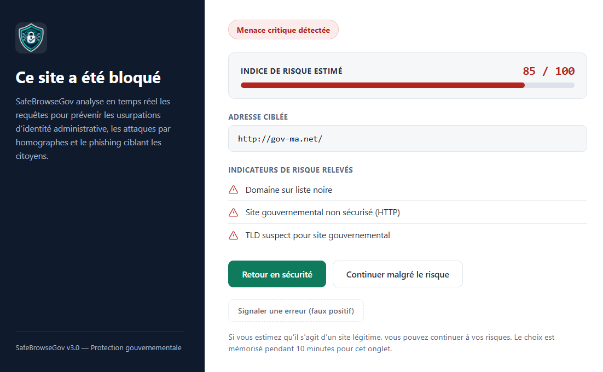
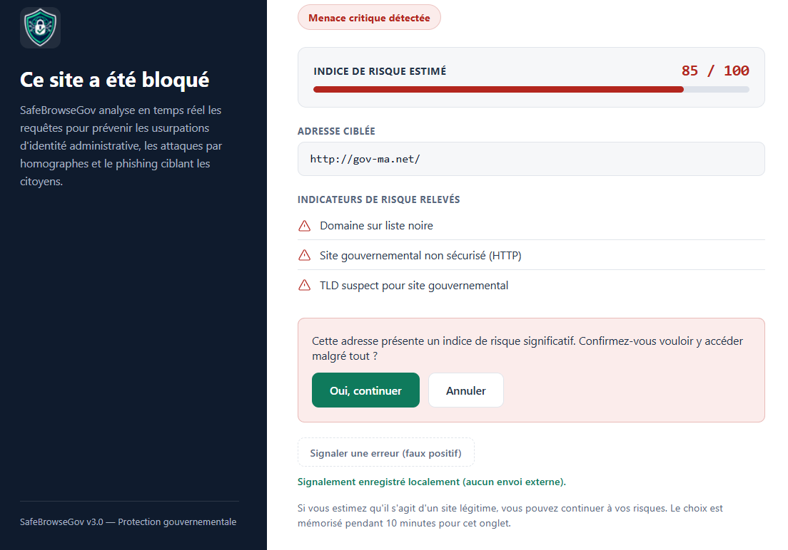
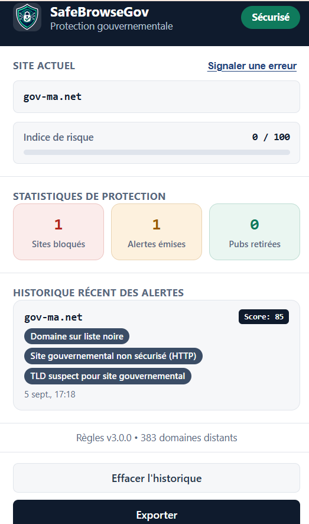
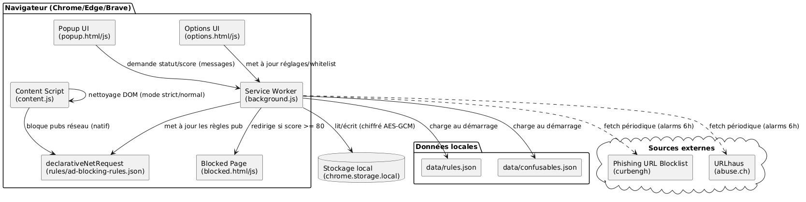
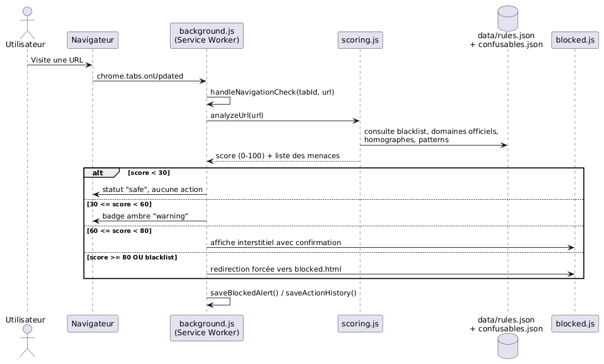
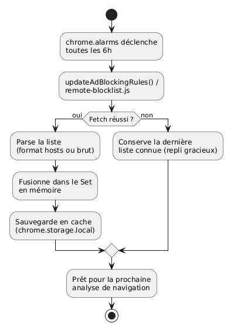

  

<h1 align="center">SafeBrowseGov — Protection Gouvernementale 🇲🇦</h1>

  
  
  

Extension de navigateur (Chrome / Edge / Brave — Manifest V3) qui protège les citoyens marocains contre le phishing gouvernemental, l'usurpation de domaines (typosquatting, homographes Unicode) et les publicités intrusives — <strong>100 % locale, sans collecte de données</strong>.

> 📌 **Ce dépôt est une vitrine de présentation du projet.** Le code source n'est pas publié publiquement. Pour toute demande d'accès ou de collaboration, contacte-moi via GitHub.

## Table des matières
- [Contexte & objectifs](#contexte--objectifs)
- [Fonctionnalités](#fonctionnalités)
- [Aperçu](#aperçu)
- [Architecture](#architecture)
- [Technologies utilisées](#technologies-utilisées)
- [Confidentialité](#confidentialité)
- [Auteurs](#auteurs)
- [Licence](#licence)

## Contexte & objectifs

Depuis plusieurs années, des campagnes de phishing ciblent les usagers des services publics marocains (impôts, CNSS, RAMED, douane, ONCF, régies de distribution d'eau/électricité) en enregistrant des noms de domaine visuellement proches des sites officiels (`service-public-ma.com`, `cnss-ma.net`, `impots-gov.ma`...). **SafeBrowseGov** a été conçu pour détecter ces tentatives d'usurpation en temps réel, directement dans le navigateur, sans dépendre d'un serveur tiers qui collecterait l'historique de navigation.

Le projet combine :
- un moteur de **scoring de risque** basé sur plusieurs signaux (liste noire, distance de Levenshtein, homographes Unicode, patterns suspects) ;
- l'intégration de **listes de menaces ouvertes** (phishing-filter, URLhaus), actualisées automatiquement ;
- un **bloqueur de publicités** natif via `declarativeNetRequest`.

## Fonctionnalités

- 🎯 **Score de risque progressif (0–100)** avec 4 paliers : sûr (`<30`), avertissement (`30–59`), alerte avec confirmation (`60–79`), blocage direct (`≥80` ou liste noire).
- 🔤 **Détection de typosquatting** par distance de Levenshtein sur les domaines officiels et populaires.
- 🌐 **Détection d'homographes Unicode / IDN Punycode** — table de plus de 2000 caractères confusables (cyrillique, grec, arménien, latin étendu).
- 📡 **Listes de blocage distantes auto-actualisées** toutes les 6h (Phishing URL Blocklist, URLhaus), avec repli gracieux hors-ligne.
- 🚫 **Bloqueur de publicités natif** via `declarativeNetRequest` (aucune injection de script réseau intrusive).
- ⚙️ **Liste blanche personnalisée**, curseur de sensibilité, mode strict optionnel.
- 🚩 **Signalement de faux positifs** directement depuis la page de blocage ou le popup.
- 🔒 **Historique local chiffré** (AES-GCM) — rien ne quitte jamais l'appareil.
- ♿ **Accessibilité WCAG AA** (aria-live, navigation clavier, contrastes renforcés).

## Aperçu

**Page de blocage** — domaine sur liste noire, score 85/100 :

**Confirmation avant de continuer malgré le risque** (signalement 100% local, aucun envoi externe) :

**Popup — statistiques de protection et historique des alertes** :

## Architecture

**Vue d'ensemble des composants** — le service worker (`background.js`) orchestre l'analyse, communique avec le popup et la page d'options, s'appuie sur `declarativeNetRequest` pour le blocage réseau et récupère périodiquement les listes de menaces distantes :

**Flux d'analyse d'une navigation** — à chaque changement d'URL, `analyzeUrl()` calcule le score et déclenche l'action correspondant au palier atteint :

**Mise à jour périodique des listes distantes** — déclenchée par `chrome.alarms` toutes les 6h, avec repli sur la dernière liste connue en cas d'échec :

## Technologies utilisées

- **JavaScript** vanilla (ES2022), aucune dépendance runtime
- **Chrome Extension Manifest V3** — service worker, `declarativeNetRequest`, `chrome.alarms`, `chrome.storage`
- **Web Crypto API** (AES-GCM) pour le chiffrement local
- **Vitest** pour les tests unitaires, **ESLint** pour le linting
- **GitHub Actions** pour l'intégration continue

## Confidentialité

SafeBrowseGov ne collecte **aucune donnée personnelle** et n'effectue **aucun traçage**. Toute l'analyse des URLs se fait localement dans le navigateur ; seules des requêtes GET anonymes vers des dépôts publics de listes de menaces sont effectuées, sans transmission d'identifiant ni d'historique de navigation.

## Auteurs

**Essadeki Oussama**
Élève ingénieur — ENSET Mohammedia, Université Hassan II de Casablanca

GitHub : [@oussama-40](https://github.com/oussama-40)

## Licence

Ce projet est distribué sous licence **MIT**.
